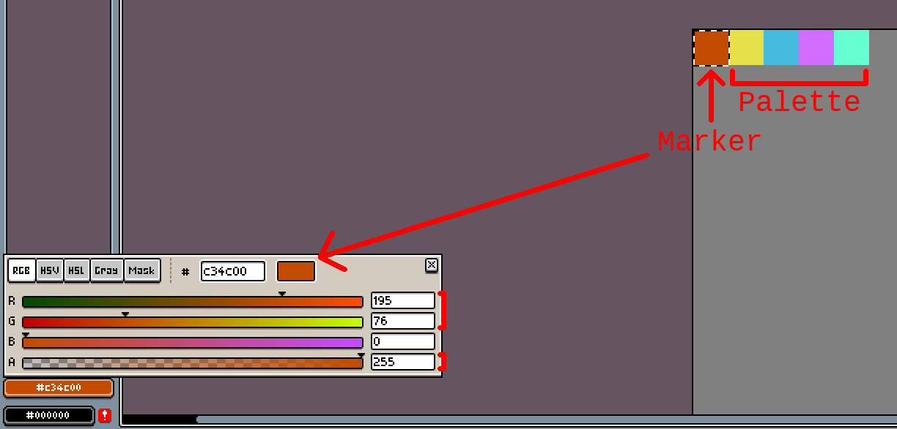

## Vanilla DI

<sub>1.20.4 branch | [1.20.5/6 branch](https://github.com/JNNGL/VanillaDI/tree/1.20.5)</sub>

A resource pack that adds custom dynamic lights with soft ray-traced shadows to vanilla Minecraft.

https://github.com/JNNGL/VanillaDI/assets/45935949/a8be5e26-b4af-4c8a-9906-d673bf124cc0


## Usage

First, you need to spawn a `leather_horse_armor` item display with CustomModelData 1 and color set to
the number of lights (in the range 0-255). There's currently no spatiotemporal resampling, so keep it as low as possible for the best results.

**Example:** `/summon item_display ~ ~ ~ {Tags:["marker"],item:{id:leather_horse_armor,Count:1,tag:{CustomModelData:1,display:{color:1}}}}` <-- 1 light will be rendered.

You need to update the color of this display every time a light source is created/removed.

**Example:** `/data merge entity @e[tag=marker,limit=1] {item:{tag:{display:{color:2}}}}` <-- Changes the number of rendered lights to 2.

**Note:** teleporting or transforming this display may cause artifacts as its position is used to calculate offset for temporal reprojection.

----

To create a light source you need to spawn an item display with corresponding CustomModelData. 
The resource pack has some built-in sample light source types in `leather_horse_armor`:

 - **CustomModelData 2**. Rectangular area light, 1.5×1 blocks. Texture: `minecraft:custom/light0.png`
 - **CustomModelData 3**. Spherical light, radius of 0.5 blocks. Texture: `minecraft:custom/light1.png`
 - **CustomModelData 4**. Spot light, disk with radius of 1.0 block. Texture: `minecraft:custom/light2.png`

The tint can be calculated as `(intensity * 256 * 256) + (colorIndex * 256) + lightIndex`,
where `intensity` is the intensity of the light source, `colorIndex` is the index in the color palette and `lightIndex` is the id of the light source.
All of these values should be in the range 0-255.

The color palette is stored in the texture and `colorIndex` can be calculated as `(y * 16) + x`, where `x` and `y` are pixel coords in the texture. Color index 0 is hardcoded to white as the pixel at (0,0) is reserved for marker and light source type.

Ideally, the id for each newly created light source should be one greater than the highest existing light id. When removing a light source, all higher light ids should be decremented by one so there are no unassigned ids.

To temporarily disable a light source, you can set its intensity to 0.

**Examples**:
<br> `/summon item_display ~ ~ ~ {Tags:["light0"],item:{id:leather_horse_armor,Count:1,tag:{CustomModelData:2,display:{color:3932160}}}}` <-- Built-in rectangular area light; with intensity 60, color index 0 (hardcoded, white), light index 0; (`60 * 256 * 256 + 0 * 256 + 0 = 3932160`)
<br> `/summon item_display ~ ~ ~ {Tags:["light1"],item:{id:leather_horse_armor,Count:1,tag:{CustomModelData:3,display:{color:3932673}}}}` <-- Built-in spherical light; with intensity 60, color index 2 (color from palette, pixel at [2,0], `(0 * 16) + 2`), light index 1; (`60 * 256 * 256 + 2 * 256 + 1 = 3932673`)
<br> `/data merge entity @e[tag=light0,limit=1] {item:{tag:{display:{color:3932416}}}}` <-- Update the light source data to intensity 60, color index 1, light index 0.

### Creating custom lights

1. **Create a texture.**

The texture should be 16x16.<br>
The pixel at coords [0,0] should have R 195, G 75, and A 255. The shader checks these values to distinguish light source textures from other textures.
The value of the blue channel of this pixel is passed to post and specifies the shape of the light source. Check out the function `samplePointOnLight` in `program/shade.fsh`.

Built-in light source types:

 - Rectangular area light; Blue channel value: 0
 - Spherical light; Blue channel value: 1 
 - Spot light; Blue channel value: 2



Other pixels are used as the color palette.

2. **Create a model.**

Pretty straightforward.

**Template:**
```json
{
  "parent": "minecraft:custom/light",
  "textures": {
    "layer0": "minecraft:custom/my_light"
  }
}
```

3. **Add an override to any item that has tint overlay.**

e.g. leather horse armor.

```json
{
  <...>
  "overrides": [
    <...>
    {"predicate": {"custom_model_data": 10}, "model": "custom/my_light"}
  ]
}
```

## Pixelization

There's an optional pixelization pass that makes the lightning aligned to the block pixels:


### Enabling pixelization

First, ensure that your `leather_horse_armor` item display with CMD 0 is on *integer* coordinates, e.g: 4.0 -60.0 -9.0. <br>
Then add the following lines to `shaders/post/transparency.json` before the `blend` pass:

```json
{
    "name": "pixelate",
    "intarget": "minecraft:main",
    "outtarget": "swap",
    "auxtargets": [
        {
            "name": "RadianceSampler",
            "id": "spatial2"
        },
        {
            "name": "DiffuseDepthSampler",
            "id": "minecraft:main:depth"
        },
        {
            "name": "NormalSampler",
            "id": "normals"
        }
    ]
},
```

and change the `LightSampler` target to `swap` in the `blend` pass.


**Warning**: this feature may be a little buggy.

## Mod compatibility

The resource pack only uses entity core shaders to pass necessary data to post, so it should be compatible with most mods.

Tested mods/modpacks:

 - Fabulously optimized
 - Simply optimized

Lmk if you encounter any issues with mods.

## More screenshots


